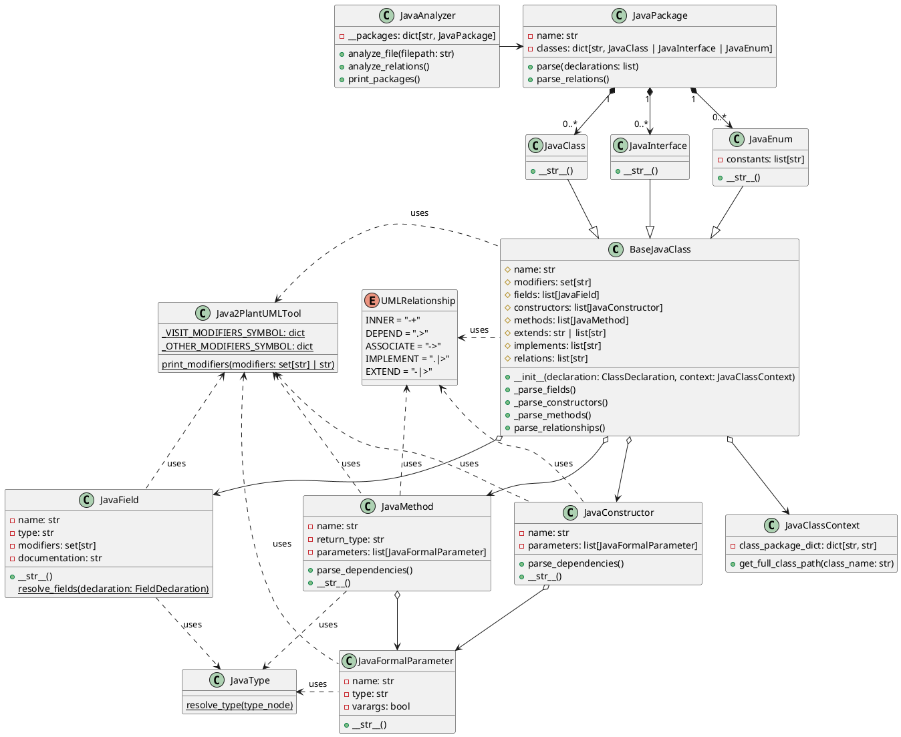

# java code to plantuml

## how to use

env: python 3.11

1. install java lang

   ```cmd
   pip install javalang
   ```
2. modify java2plantumlmain.py

   ```python
   import os
   from javaanalyzer import JavaAnalyzer

   if __name__ == "__main__":
       analyzer = JavaAnalyzer() # get an analyzer for one project
       # then get all java files, analyze them by "analyzer.analyze_file"
       for root, dirs, files in os.walk("javaCodeTest3"):
           for file in files:
               if file.endswith(".java"):
                   analyzer.analyze_file(os.path.join(root, file))

       # analyze dependence and association
       analyzer.analyze_relations()

       #final print
       print('@startuml')
       analyzer.print_packages()
       analyzer.print_relations()
       print('@enduml')

   ```
3. run java2plantumlmain.py

## feature

1. support multi-files
2. support simple package, class, interface, enum, method, field

## future

1. inner class support

## structure


